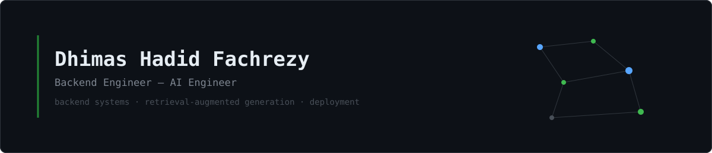

  

  <a href="https://linkedin.com/in/dhimashadid">LinkedIn</a> ·
  <a href="https://dhimas-zeta.vercel.app/">Portfolio</a> ·
  <a href="mailto:your-email@example.com">Email</a>

## About

Recent Informatics Engineering graduate (GPA 3.74/4.00) focused on backend systems and applied AI. I build RESTful APIs, database-driven applications, and retrieval-augmented generation pipelines, from architecture through deployment.

## Work

**MindHarbor — hybrid RAG mental health screening system**

Rebuilt a rule-based screening chatbot as a hybrid retrieval system: an adaptive query router splits traffic between structured PostgreSQL lookups and semantic search, combining dense (Qdrant) and lexical (BM25) retrieval through distribution-based score fusion.

| Users reached | Router accuracy | RAGAS faithfulness | Publication |
|:---:|:---:|:---:|:---:|
| 120+ | 100% | 0.935 | First author, SINTA 4, JUPTIK 2026 |

`Python` `FastAPI` `PostgreSQL` `Qdrant` `BM25`

**Warung UMKM Riau — rental and sales management system**

Backend for digitizing manual rental and sales operations at a local business: role-based access control, transaction and inventory management, and booth location tracking on an interactive map.

`Node.js` `Express` `TypeScript` `MySQL` `Leaflet`

## Stack

| | |
|---|---|
| Backend | Python, JavaScript/TypeScript, Node.js, Express, FastAPI |
| AI & retrieval | Hybrid RAG, LLMs, NLP, BM25, Qdrant |
| Data | PostgreSQL, MySQL |
| Infrastructure | Docker, Nginx, Git |

## Education

B.Eng in Informatics Engineering — Universitas Islam Negeri Sultan Syarif Kasim Riau, 2022–2026 (GPA 3.74/4.00)

## Certifications

- JavaScript Essentials 1 — Cisco
- Software Engineer / Software Engineer Intern — HackerRank
- Legacy JavaScript Algorithms and Data Structures — freeCodeCamp
- Backend Development Fundamentals — MySkill
- Data Analysis & Visualization — MySkill × Deloitte

 

  <a href="https://linkedin.com/in/dhimashadid">LinkedIn</a> · <a href="https://dhimas-zeta.vercel.app/">Portfolio</a>

